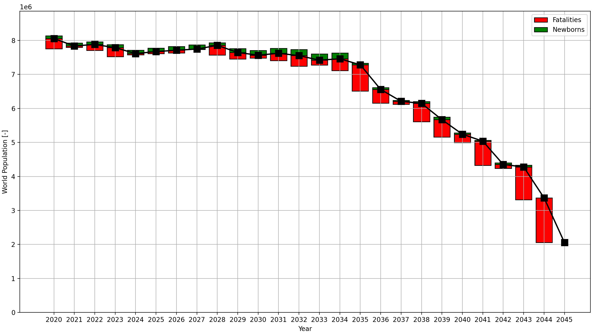

# WarBot

A sort of autonomous, simulated game of world-conquest in Python3.

## How to Run Stuff and Add Things

### Running a Game
To play, navigate to the project root folder `<PRJ_ROOT>/` i.e. that folder on
your machine where this repo is and then run `main.py`. It should be executable,
so on Unix systems simply do
```bash
  ./main.py
```
Then follow the instructions appearing on screen. To run the game in verbose
mode, use the `-v` option, i.e.
```bash
  ./main.py -v
```

### WarBot in your browser
If you want, you can also play WarBot in your browser. The online WarBot is
powered by flask. In order to run it, first install the requirements listed in
`requirements.txt`. Then you can run the executable of flask in the WarBot folder
using the command `flask run`. You can then open the link http://127.0.0.1:5000/.
Have fun!


### Required Folder Structure
The game assumes a specific folder structure to be place for working. At the
bare minimum, the following files at these locations should be present:
```
  <PRJ_ROOT>/
    main.py
    src/
      AuxiliaryTools.py
      WarBot.py
      ...                         # And all other source modules
      test/
        test_AuxiliaryTools.py
        test_WarBot.py
        ...                       # A test file for each module.
    worlds/
      <World_I>/
        states.json
        ...                       # Other auxiliary files
      <World_II>/
        states.json
        ...
      ...                         # Any other number of worlds
    x/
      run_tests.sh
```
here `<World_I>` and `<World_II>` are placeholders for actual implemented
worlds.


### Running Tests
The source is developed in an issue- and test-oriented way, so each
functionality comes with a test. Test files have to be placed in the
`<PRJ_ROOT>/src/test/` folder, the filename has to start with `test_`. To run
all tests, call
```bash
  ./x/run_tests.sh
```
from `<PRJ_ROOT>/`.


### Adding (Brave) New Worlds
Any world needs to have its own folder in the `<PRJ_ROOT>/worlds/` folder. The
world's folder name defines the world's name. Does this make sense? Good. In
each world-subfolder, a JSON file called `states.json` is expected to exist.
This JSON file needs to define the states of that world as follows:
```json
{
  "states": {
    "<state_name>": {
      "pop": <int>,
      "area": <float>,
      "id": <int> unique,
      "neighbors": <list[str]>,
      "growth_rate": <float>
    }
  }
}
```
The JSON file can contain also other items, but it does not have to. Check
`<PRJ_ROOT>/worlds/Debugland/states.json` for a comprehensive and up-to-date
example. This file is the bare minimum - in terms of structure - required for
the game to work.


## Acronyms
The following acronyms are used throughout the source and documentation.

|Acronym | Meaning|
|:-------|:-------|
|TBI     | To be implemented |
|WIP     | Work in progress |
|`cr`    | Computed result |
|`er`    | Expected result |


## Contributing Guidelines
Please review the guidelines reported in CONTRIBUTING before starting to work on
this project.


### Testing
The code is tested using Python's built-in `unittest` module. Each method has to
be tested before being accepted into the master branch - exceptions apply. For
exceptions (methods and functions for which a test either cannot be written or
the employed module is not suitable) it is asked to write a test which gets
skipped. The rationale behind this is like using `NotImplemented` as a
placeholder instead of `pass`.


## Game Description
The world was at peace. Before the beginning, no battles were occurring. States
were secretly getting ready, growing and building infrastructure.
Suddenly, on a nice sunny day, complete mayhem broke out. States started
battling each other, everyone wanted to conquer the world... Silly states. But
so the story goes and eventually a new overlord imposed itself and reigned ever
since. This is, in a nutshell, what happens during a game.


### First Things First: Before the Beginning
A peaceful but tense **world** exists at the beginning. This is a collection
of **states**. A state has an **area**, a **population**, a **growth rate** (TBI),
a **shape** (TBI), and **neighbors**. Neighbors are problematic. No state wants
neighbors. The only solution: conquer everybody else. The world is fully defined
by a (set of) JSON files and the user can choose in which realm they want to
play.


### Could Not Care Less About What is About to go Down: Time and Turns
To spare the user from complete chaos there is but one thing: time. Time does
not care about the states. It goes on, turn by turn. Battles can only occur
during a **turn**. A turn is the elementary time unit in this bizarre world. At
each turn, at least one battle is guaranteed to occur.
* At the beginning of a turn: battling pairs are picked (randomly);
* During a turn:
  * Battles take place;
  * Resting states grow (TBI);
* At the end of a turn: the states are updated based on the growth and battle outcomes.


### After the End: Last State Standing
After a set of (max) turns or when a single overlord remains (and no insurgences
are allowed (TBI)) the game ends in void. Like in the real world, it started from
nothing and will (possibly) end in nothing. Here though you get something as you
survive the end of it: the knowledge of how it ended and statistics (TBI)
about what happened.


### Example Turn Visualization
The following images describe more than what thousands of words ever could, how
a turn goes down.


The world is (seemingly) at peace.


C and G clash! It is a fierce battle determined purely by a pseudorandom number
generator... While the two fight, the others grow.


The turn is over. C won the battle and thus is now in control of what formerly
known as G. Who knows if the fierce Gers will revolt in the future? New
neighbors have been defined for (all) the states. The game can continue - what
will happen next?


## History Statistics and Visualization
The history of any game is analyzed by the `HistoryStatistician` module. More is
yet to come.


Example history world population visualization.
